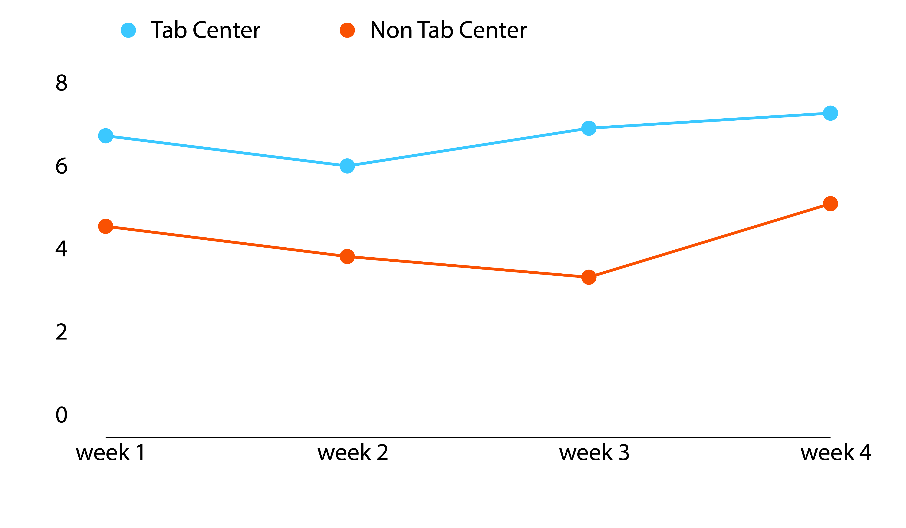
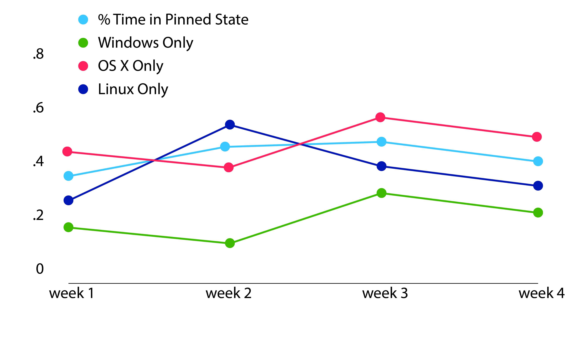
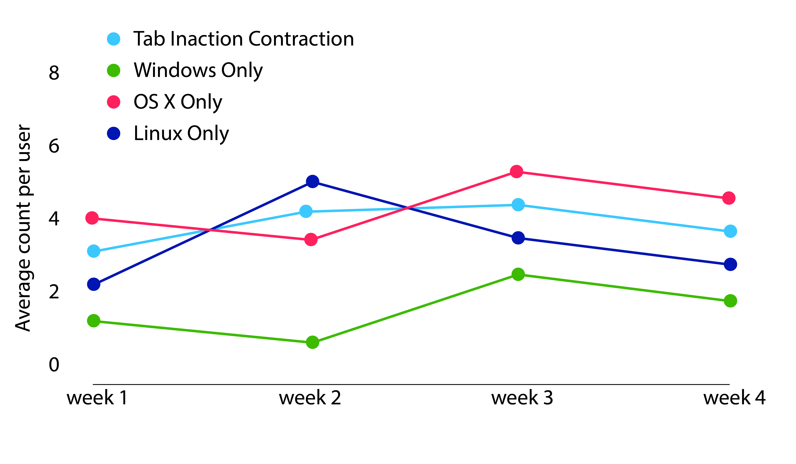
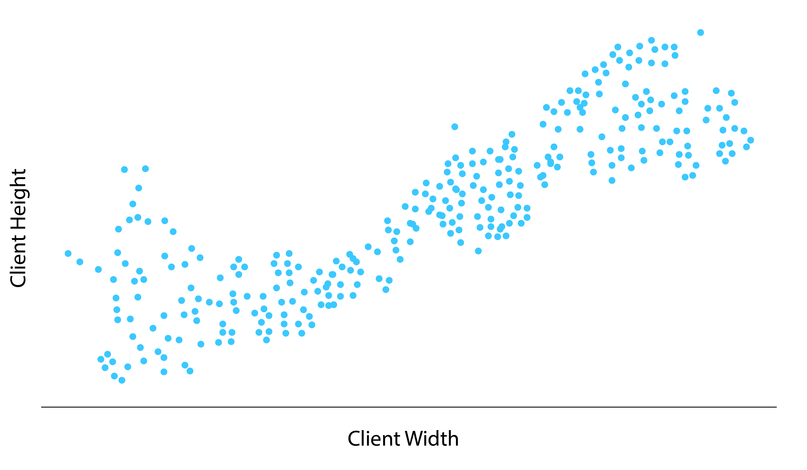
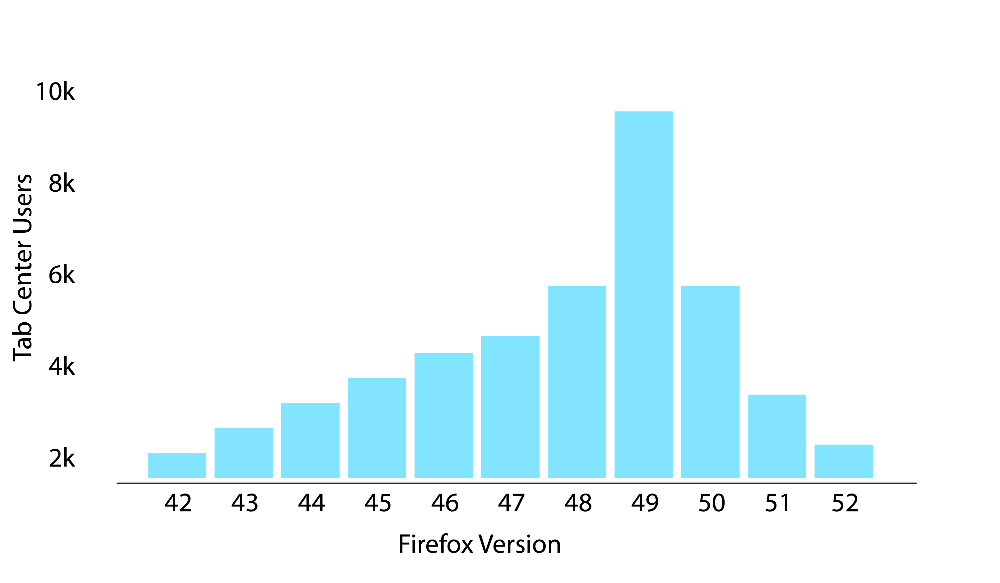
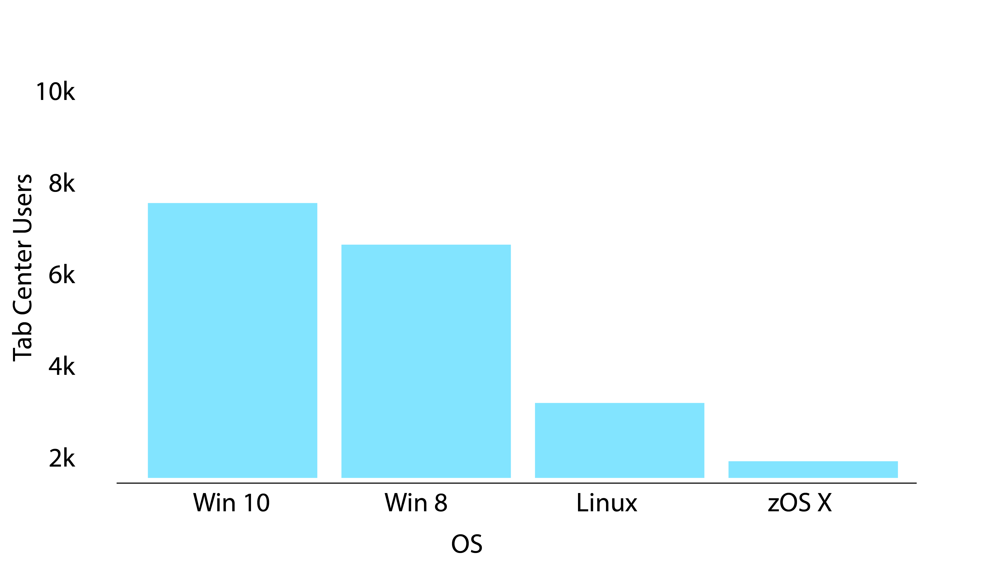
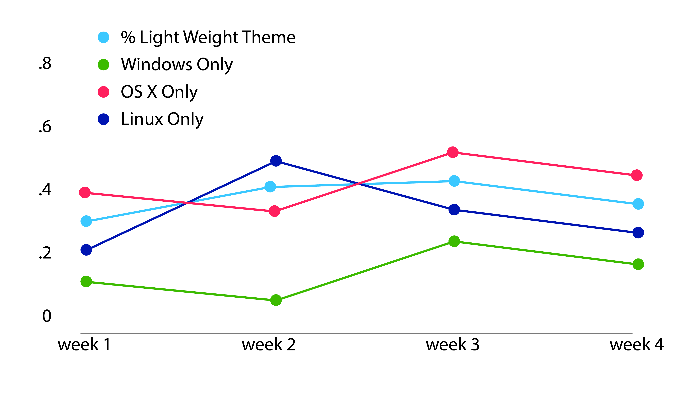

Tab Center Launch Metrics

# Tab Center Metrics

A summary of the metrics the Tab Center add-on will record.

**Definitions:**

- **Tab Center** — The vertical tab tray on the right side of the browser.
- **Pin/Unpin Tab Center** — Locking or unlocking the tab center UI to/from a fixed position.

## Data analysis

The collected data will primarily be used to answer the following questions.

### Key performance indicators

Tab Center's Primary KPIs will be derived from the random survey score and engagement ratio generated by Test Pilot.

### Additional analysis

#### User retention

_Do Tab Center users have longer sessions than other users with Telemetry enabled? Do Tab Center users have longer sessions than other Test Pilot users w/o Tab Center enabled?_

This is not intended as a precise comparative measure but it gives some insight into the overall stickiness of tab center as a differentiating feature.

#### Average Tabs

_Do users with T.C. have a higher average number of tabs?_

Do users with T.C. have a higher average number of tabs per session than other users with UI Telemetry enabled?



_Do people default to the Pinned or Unpinned state more often? At what rate do people change back and forth?_

This will give us an understanding of usage patterns within Tab Center. Does the expand/contract UI with great frequency over a session or do users bucket into mostly pinned and mostly unpinned?



_At what rate do people trigger Tab center expansion and contraction events without otherwise interacting with the tab center UI?_

Triggering this event at a high frequency likely indicates unintended action on the part of the user.



_Do client window dimensions and fullscreen mode affect Tab center usage?_

How do user agent settings affect Tab Center? Is Tab Center more used at certain display sizes and resolutions?



_Release Channel & OS_

Different versions of Firefox have different overall UI (OS X/ Windows/ Linux & Release vs Dev. Edition). Does Tab Center usage track to the broader distribution of Test Pilot users? Anomalies here will help us identify os/version specific issues.





_Is lightweight theme enabled?_

Themes can specify color schemes, this metric tracks what % of our users make use of themes. If a high number we will consider modifying the color scheme of tab center to better match dark themes




## Data collection

Metrics gathered from the Tab Center add-on will be reported to the Test Pilot add-on, which will augment that information and relay it to Firefox’s telemetry system via `submitExternalPing`.

### Telemetry Based Diagnostic Measures

We will collect measures on how users use Tab Center so that if the engagement metrics collected by Test Pilot rise or fall, we can diagnose why/how users might be using the feature differently.

The following Telemetry metrics will be important for optimizing tab Center

- Session Length
- Browser/Client metrics
  - Release Channel
  - OS
  - Firefox Version
  - Using Lightweight theme?
- Window metrics
  - Is browser in fullscreen mode?
  - Client window dimensions?
  - Display resolution

Tab Center will record and report each of the following metrics:

-  Tab behaviors, specifically:
  - Tab creations
  - Tab destructions
  - Tab pins
  - Tab unpins
- Tab Center actions, specifically:
  - Tab Center on-boarding tour:
    - complete or incomplete
    - button clicks within the tour
  - Tab Center pins
  - Tab Center unpins
  - Tab Center contraction events
  - Tab Center expansion events
  - Tab Center activated
  - Tab Center inactivated
  - Tab Center tabs in reverse order
  - Tab Center show large thumbnails

This data will be used in three ways:

1. To gain a deeper understanding of how users make use of Tab Center.
2. To gain a deeper understanding of how Tab Center users compared to non-Tab Center users.
3. To segment users into categories that suggest actionable UI changes to Tab Center.

## Data Collection Details

Tab Center is a purely client-side experiment so we will only be collecting metrics from the client leveraging Test Pilot’s reporting functionality with the `testpilottest` type identifier.

Tab Center will record data and submit it on each event trigger.

An example payload (within the full Telemetry ping):

```js
{
  "version": 2,
  "tab_center_tabs_on_top": false,
  "tab_center_show_thumbnails": true,
  "tab_center_window_id": 1,
  "tab_center_currently_toggled_on": true,
  "tour_completed": false,
  "event_type": "tour_began",
  "details": "reminder"
}
```

And the schema we will use for Redshift:
```sql
local schema = {
--   column name                        field type    length  attributes   field name
    {"version",                         "INTEGER",    nil,    nil,        "version"},
    {"timestamp",                       "TIMESTAMP",  nil,    "SORTKEY",  "Timestamp"},
    {"uuid",                            "VARCHAR",    36,     nil,        get_uuid},
    {"service",                         "VARCHAR",    255,    nil,        "test"},
    {"tour_completed",                  "BOOLEAN",    nil,    nil,        "tour_completed"},
    {"tab_center_tabs_on_top",          "BOOLEAN",    nil,    nil,        "tab_center_tabs_on_top"},
    {"tab_center_show_thumbnails",      "BOOLEAN",    nil,    nil,        "tab_center_show_thumbnails"},
    {"tab_center_window_id",            "INTEGER",    nil,    nil,        "tab_center_window_id"},
    {"tab_center_currently_toggled_on", "BOOLEAN",    nil,    nil,        "tab_center_currently_toggled_on"},
    {"event_type",                      "VARCHAR",    255,    nil,        "event_type"},
    {"details",                         "VARCHAR",    255,    nil,        "details"}
}

```

Possible values for `event_type`:

```js
"tabs_created",
"tabs_destroyed",
"tabs_pinned",
"tabs_unpinned",
"tab_center_pinned",
"tab_center_unpinned",
"tab_center_expanded",
"tab_center_toggled_off",
"tab_center_toggled_on",
"tab_center_search_focus",
"tab_center_search_blur",
"tour_began",
"tour_accepted",
"tour_continue",
"tour_complete",
"tour_dismissed",
"hotkey_on",
"hotkey_off"
```

Possible values for `details`:

```js
"install",
"reminder",
"completed_reminder",
"search_engaged"
```
